# raylib-android

raylib on an Android phone, driven from Clojure by
[jolt](https://github.com/jolt-lang/jolt), as native arm64 code with no JVM,
no Kotlin and no Java anywhere in the app.

What runs today: a gallery of seventeen scenes in four categories, each one a
pure `.cljc` simulation, under an Android owner loop of about thirty lines.
Tap a card to open a scene; Back walks one level up and quits from the top. The
bird flaps on a press edge.

<p>
  <a href="docs/images/gallery.png">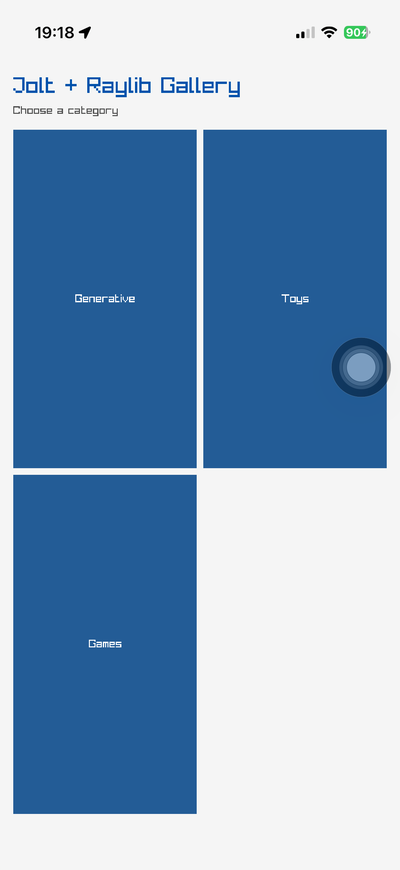</a>
  <a href="docs/images/spirograph.png">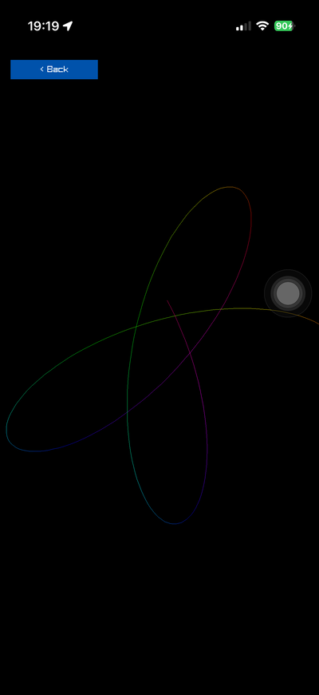</a>
  <a href="docs/images/penrose.png"></a>
  <a href="docs/images/kaleidoscope.png"></a>
</p>
<p>
  <a href="docs/images/boids.png">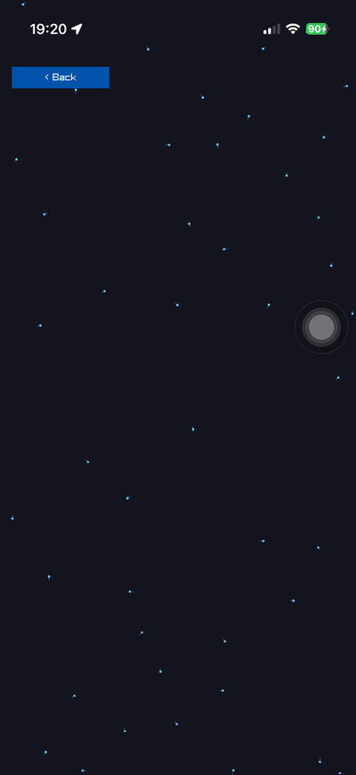</a>
  <a href="docs/images/fireworks.png">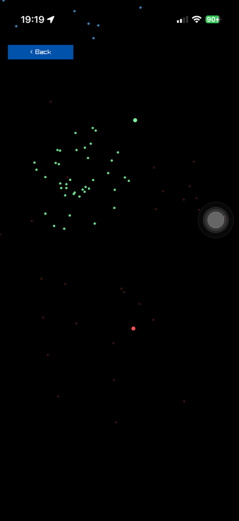</a>
  <a href="docs/images/flappy-bird.png">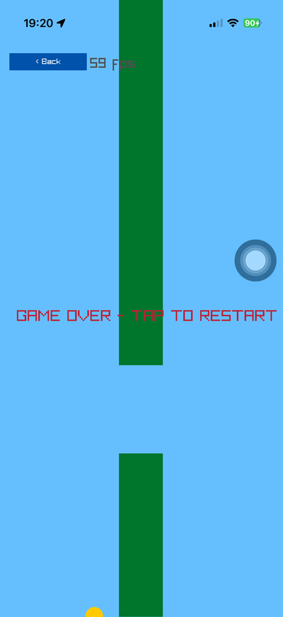</a>
</p>

<p>
  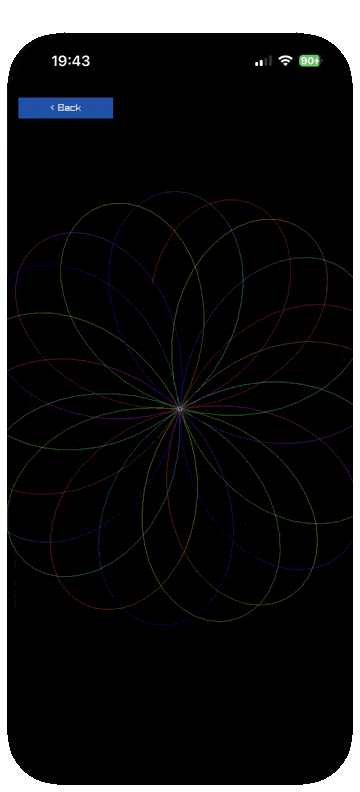
  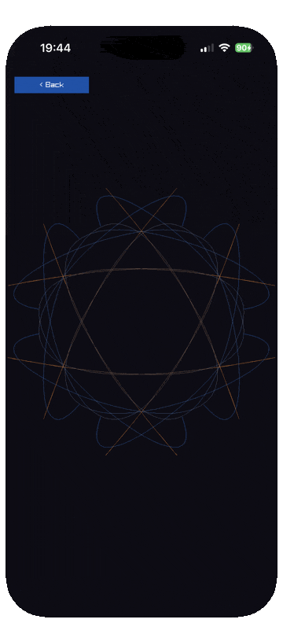
  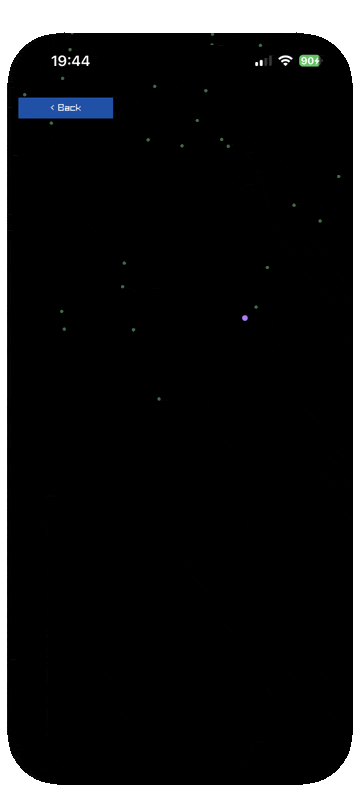
  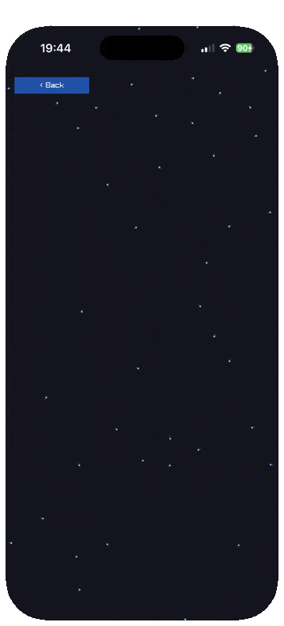
  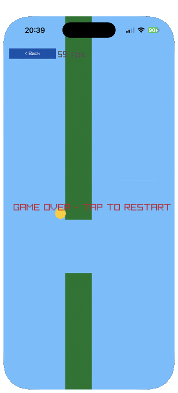
</p>
<p>
  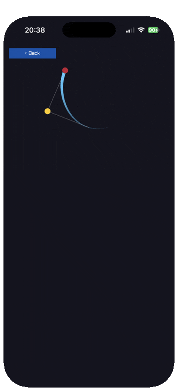
  
  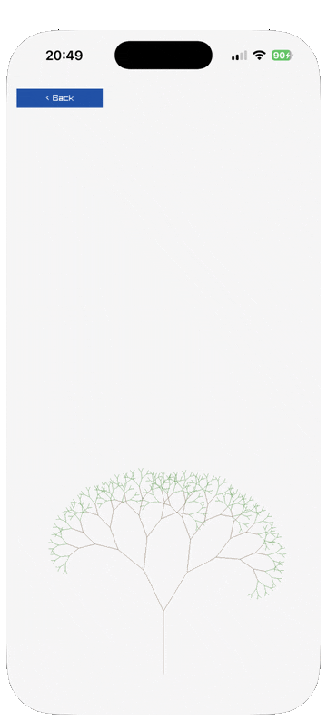
  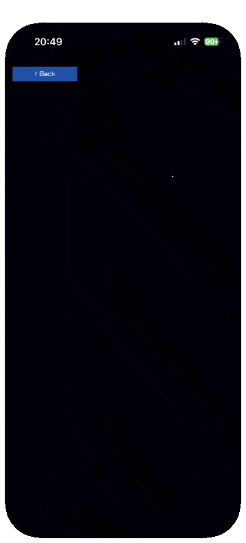
  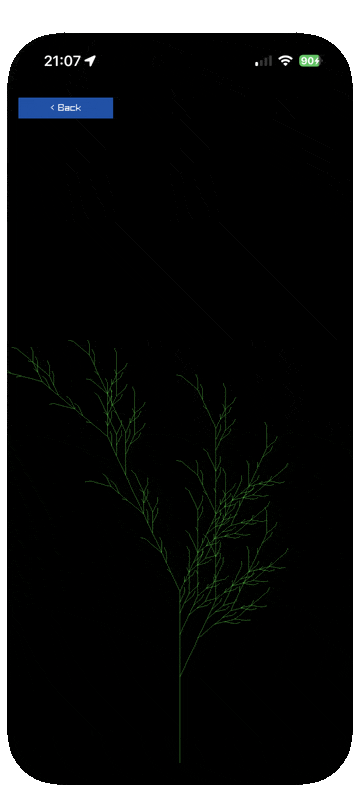
  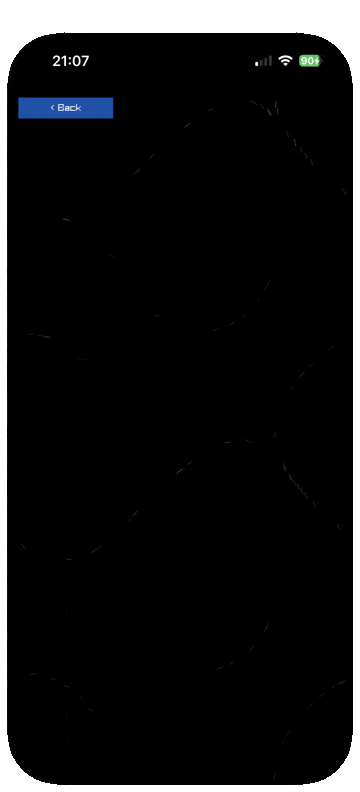
</p>
<p>
  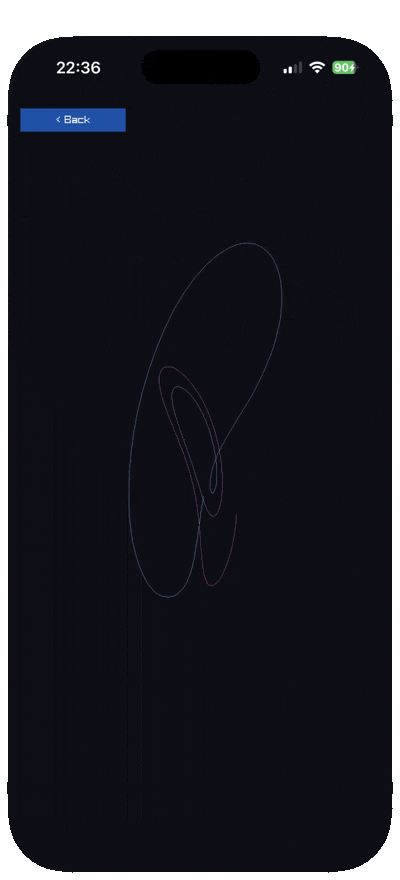
  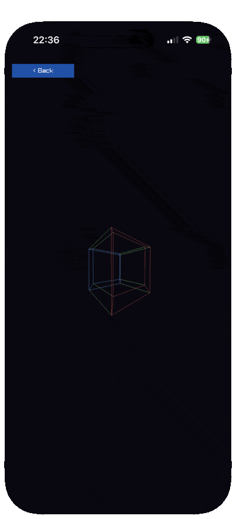
</p>

> **Every image above was captured on an iPhone**, by
> [raylib-ios](https://github.com/jlt-commons/raylib-ios), the sibling project
> this one was ported from. The scenes are the same files — pure `.cljc`, with
> the host below them swapped — but nothing here has been photographed on an
> Android device yet, and neither have the frame times further down. They are
> kept because they show what the scenes are; replacing them is the first job
> after this port meets a phone.

Licensed [zlib](LICENSE), matching raylib and
[raylib-jlt](https://github.com/jlt-commons/raylib-jlt). Third-party code and
attribution are in [`NOTICE`](NOTICE).

## Where the code came from

Two projects, in layers.

[jasalt/jolt-android-experiment](https://github.com/jasalt/jolt-android-experiment)
established both halves of what runs here. Its `raylib/` track proved the
Android recipe — Chez cross-built against Bionic, `jolt build --library`, and a
NativeActivity C `main` that dlopens the result and calls one exported symbol
(RAY-009, RAY-017, RAY-018) — and its six pure `.cljc` namespaces are the scene
contract that makes every scene in this repository testable without a device.

Larry Staton's [glimmer-ios-demo](https://github.com/statonjr/glimmer-ios-demo)
wrote the owner loop and the scene ports, as two literate org notebooks:
`examples/flappy` (milestones 0 to 5, the toolchain and the loop) and
`examples/gallery` (the scene contract on top of it). Both are worth reading,
because they keep the mistakes as well as the answers.
[raylib-ios](https://github.com/jlt-commons/raylib-ios) turned those notebooks
into this source tree, added fourteen more scenes and measured them; this
project is that tree with the iOS half replaced.

`tools/extract-from-notebooks` did the one-time extraction from the notebooks
and is kept for provenance: it refuses to overwrite a file that has since been
edited, and it checks the six pure namespaces against the sha256 the notebooks
record.

```
$ ./tools/extract-from-notebooks
byte-identity of the pure namespaces (jasalt/jolt-android-experiment @ 6d2b291):
  src/poc/raylib/diagnostics.cljc        ok  179b24736879fdf1
  src/poc/raylib/flappy_bird.cljc        ok  4d9cf3ae1984613d
  src/poc/raylib/following_eyes.cljc     ok  9dcd98e36aafcb78
  src/poc/raylib/gallery.cljc            ok  6bfc1f12cb425b9b
  src/poc/raylib/gallery_ui.cljc         ok  a2301b268d555504
  src/poc/raylib/touch_trail.cljc        ok  242385a4855c083a
```

## How Clojure ends up owning an Android frame loop

raylib has a real Android backend, and that changes the shape of everything.
The iOS sibling had none to use — there is no `rcore_ios.c` and raylib issue
#330 was closed in 2018 without one — so it built raylib with `PLATFORM=SDL`
against an SDL2 for iOS and let SDL be the platform layer. Here
`src/platforms/rcore_android.c` is the platform layer: EGL, GLES2, touch, the
activity lifecycle and the ALooper pump, all of it upstream and maintained.

What it asks of an app is one C function. At the pinned revision, lines 318-331:

```c
extern int main(int argc, char *argv[]);

void android_main(struct android_app *app)
{
    char arg0[] = "raylib";
    platform.app = app;
    (void)main(1, (char *[]) { arg0, NULL });
    ANativeActivity_finish(app->activity);
    /* ... pump events until destroyRequested ... */
}
```

So `main` **is** the app's lifetime, and returning from it quits. That `main`
is [`tools/android/app/src/main/cpp/main.c`](tools/android/app/src/main/cpp/main.c),
the only C this project has, and all it does is bootstrap Jolt:

1. `jolt build --library` cross-compiles the entry namespace to
   `libjoltraylib.so` — a shared object exporting `jolt_library_init`,
   `jolt_lookup` and `jolt_library_shutdown`, in which one Clojure function has
   published a C-callable name with `ffi/export!`.
2. `main.c` dlopens it, calls `jolt_library_init`, resolves that name through
   `jolt_lookup`, and calls it.
3. That call is `raylib.host/run!`, the frame loop, which therefore runs on the
   thread `android_main` handed over — the thread raylib polls its ALooper on,
   and the only one raylib or GLES may be touched from.

raylib itself is compiled from pinned source by the APK's own CMake and linked
**statically** into `libmain.so`, the NativeActivity library. So every raylib
symbol a `defcfn` names is already in the process image, and the Jolt library
resolves it by dlopening `libmain.so` — which is the one `:jolt/native` entry
in `deps.edn`, marked optional so the namespaces still load on a build host.
There is no `libraylib.so` in the APK, which is why the published raylib
bindings' own `:jolt/native` declarations would be actively wrong here.

The code the phone runs is **native arm64** (`tarm64le`), not bytecode. That is
the one place this port is unambiguously better off than the iOS one: iOS
requires executable pages to come from a signed, immutable source, so a native
Chez build there dies on launch with `mprotect failed` and the whole app has to
be threaded portable bytecode. Android has no such rule.

## Prerequisites

- **jolt 0.8.1 or newer.** `deps.edn` sets the floor with `:jolt/min-version`,
  and jolt refuses to build below it. `ffi/write` swapped its value and offset
  arguments at 0.8.0 and an older jolt cannot tell the two spellings apart, so
  it would write the wrong byte to the wrong place in silence. 0.8.1 rather
  than 0.8.0 because this build is a `--library` cross-compile of a source-mode
  image, and jolt#756 — fixed in 0.8.1 — left `jolt.ffi`'s own Clojure layer
  interned but *unbound* in exactly that combination. The Android experiment
  had to carry a patch for it; this needs none.
- **JDK 17 and Gradle 8.9 or newer**, on `PATH`. AGP 8.7 wants both.
- **The Android SDK** with platform 35 and platform-tools, and **an NDK**.
  `tools/android/build.sh` finds the NDK and passes the same one to Gradle and
  to the Chez cross-build, so they cannot end up disagreeing.
- **An arm64 device.** The APK carries one ABI. `jolt devices` says whether a
  connected device can run it; an x86_64 emulator without ARM64 translation
  installs it and then fails to load `libmain.so`.
- **An x86_64 Linux host, or an Apple Silicon Mac**, to build on.
  `tools/android/pack.sh` refuses arm64 Linux and says why: Chez has one
  machine type (`tarm64le`) for both sides of that cross, so the host build and
  the Android build would overwrite each other.

Chez Scheme is *not* a prerequisite. `pack.sh` clones the pinned v10.4.1 into
`~/.cache/raylib-android` and cross-builds it there, which is the one slow step
in this project and takes about fifteen minutes, once.

No private repositories are needed, and the default build has no dependencies
at all.

## Quick start

```sh
jolt test                     # 35 tests, 275 assertions, no device needed
jolt deps                     # the pinned raylib source, once
jolt pack                     # Chez, cross-built for Bionic. ~15 minutes, once
jolt devices                  # what is connected, and whether it is arm64

NS=raylib.touch jolt build-app    # the smallest thing that draws and responds
jolt deploy
jolt log                          # the app's console, because there is no other
```

`jolt build-app` builds the debug variant; `jolt release` builds the other one.
They are two tasks rather than one with an argument because **a jolt task takes
no arguments** — `jolt build-app release` would run `build.sh` with none and
quietly build debug. `MODE=release` works on either, and on `jolt deploy`.

Then the gallery, and the REPL:

```sh
jolt live                                    # raylib.live: the gallery plus an nREPL
tools/android/nrepl eval 7888 '(System/getProperty "os.arch")'   # prove it is the phone
tools/android/nrepl repl 7888                # or a prompt
```

**There is no console.** An Android app's stdout goes to `/dev/null`, so
`println` writes into nothing: every diagnostic here goes through
`raylib.host/log`, which calls `__android_log_write`, and `jolt log` is where
it lands — alongside raylib's own `TRACELOG` under the `raylib` tag and a
tombstone under `DEBUG` if the process dies.

Reads over the nREPL are free. Anything touching raylib goes through
`raylib.host/on-next-frame!`, which runs it at the top of the next frame on the
owner thread, because an eval lands on the nREPL thread and raylib belongs to
the thread `android_main` gave the loop.

That gives you jolt's built-in ops: `clone`, `describe`, `eval`, `load-file`,
`close`. Enough for a script or a prompt. For an editor, `CIDER=1 jolt live`
builds `raylib.live-cider` under the `:cider` alias and adds completions,
`info`, `eldoc`, the namespace browser, macroexpansion, apropos and the test
ops, by composing [jolt-lang/nrepl](https://github.com/jolt-lang/nrepl) over
the same handler. It is the project's only dependency and it is opt-in, which
is why the paragraph above can still say there are none.

For live development against the running app, and for every failure worth
recognising on sight, see
[`tools/android/RUNBOOK.md`](tools/android/RUNBOOK.md).

### Namespaces worth building

One entry namespace per APK: the `ffi/export!` at the bottom of each is the
name `main.c` looks up, and two in one image would leave whichever loaded last
holding it.

| namespace | what it does |
|---|---|
| `raylib.touch` | scalar touch polling, press edges, a marker under the finger. The bring-up rung |
| `raylib.flappy` | the Android experiment's Flappy Bird, unchanged, under the owner loop |
| `raylib.gallery` | the scene contract: categories, cards, hit testing, Back, all seventeen scenes |
| `raylib.live` | the gallery plus an nREPL, so an editor can drive the running app |
| `raylib.live-cider` | the same with the cider-nrepl ops, under `-A:cider` (the one optional dependency) |

`raylib.gallery` is what a release build ships; `raylib.live` is the debug
default. The two are kept apart structurally rather than by discipline: the
debug manifest is the only one that asks for `INTERNET`, and `main.c` refuses
to run a release image in which the nREPL entry point exists at all.

`raylib.touch` is a bring-up tool, kept on purpose. Nothing runs it and it is
not dead code: it is the rung that isolates a failure when the gallery does not
come up, being the smallest thing that opens a window, draws, and responds to a
finger. Reach for it first after an NDK, SDK, Gradle or raylib bump, when the
useful question is which layer moved rather than what the gallery is doing.
Below even that is `jolt log`, where `main.c` names every bootstrap step it
completed.

Ported examples live in `src/raylib/scenes/`. They are pure `.cljc` in the same
shape as the six from the Android experiment, so they test on the build host,
and `raylib.gallery` owns their drawing. Two guides worth reading before adding
to this: [docs/guide/porting-an-example.md](docs/guide/porting-an-example.md)
for the four changes a raylib-jlt example needs, and
[docs/guide/performance-on-a-phone.md](docs/guide/performance-on-a-phone.md)
for why the first two ports ran at 15 fps and what fixed them. The short
version of the second is that the FFI was never the problem.

**Develop on the debug build**, which is `--dev`. A release image inlines
across call sites, so a var redefined over the nREPL reaches the REPL and not
the running loop. See the RUNBOOK.

## Layout

```
src/raylib/host.clj      the owner loop: InitWindow, the frame, Back, logcat
src/raylib/probe.clj     the measuring apparatus, all of it off by default
src/raylib/{touch,flappy,gallery,live}.clj   entry namespaces for that host
src/raylib/scenes/*.cljc  fourteen pure scenes, drawn by raylib.gallery
src/poc/raylib/*.cljc    six pure namespaces, byte-identical to 6d2b291
test/poc/raylib/*.cljc   their tests, likewise
tools/android/deps.sh    the pinned raylib source
tools/android/pack.sh    ChezScheme, cross-built against Bionic, -fPIC
tools/android/build.sh   jolt build --library, then Gradle
tools/android/deploy.sh  adb install, force-stop, am start
tools/android/log.sh     the app's console
tools/android/nrepl      a dependency-free nREPL client
tools/android/app/       the Gradle module: one manifest, one CMakeLists, one main.c
```

`raylib.host` takes a scene as `{:title :init :frame}` and calls `(frame
state)` between `BeginDrawing` and `EndDrawing`. A scene is a reducer over
frames, so nothing in it polls, draws or holds a native value. That contract is
the Android experiment's, and it is the reason their `.cljc` files run here
untouched.

## Six traps the tooling encodes

**Bionic has no `librt` and no `libpthread`.** They are folded into libc, so
naming them fails the link — and jolt's own target-pack default for a `*le`
machine names both, because `tarm64le` cannot distinguish glibc Linux from
Android (jolt's cross-compile README says exactly that). `pack.sh` writes
`link-libs` itself: `-llz4 -lz -lm -ldl`. `build.sh` then reads the built
library's `DT_NEEDED` and checks for Bionic's `libc.so` rather than glibc's
`libc.so.6`, which is the one line that proves the pack was Android's.

**`--library` needs `-fPIC` everywhere.** The flag folds `libkernel.a`, lz4 and
zlib into a shared object, so all three have to be position-independent —
hence `CFLAGS="-fPIC -O2"` on Chez's cross configure.

**Chez's kernel wants iconv, and Bionic has none.** `--disable-iconv`. It is
the only Android-specific `--disable` in `pack.sh` that is not also standard
practice for a cross build.

**`-u ANativeActivity_onCreate`, or the entry point is dropped.** raylib
defines it, in the NDK glue it compiles in, but nothing in `main.c` references
it — so the linker drops it from a static archive and Android reports "Unable
to find native library entry point". raylib passes that flag for its own shared
library link, and `add_subdirectory` does not export a subdirectory's
`CMAKE_SHARED_LINKER_FLAGS`, so `CMakeLists.txt` repeats it.

**`-Wl,--wrap=fopen` has to reach the final link.** raylib wraps `fopen` to
read APK assets, and the wrap only works at the link that produces the loaded
object. raylib declares it `PUBLIC`, so CMake propagates it to `libmain.so`
automatically; that is worth knowing rather than doing, because a hand-rolled
link would have to pass it.

**Debug and release stage their libraries apart.** `libjoltraylib.so` goes into
`app/src/debug/jniLibs` or `app/src/release/jniLibs`, which are AGP's own
per-variant defaults. One shared staging directory — which is what the
upstream experiment used — lets a release APK quietly pick up a debug library
that is still lying there, and a debug library is the one with the nREPL in it.

## Numbers, measured — on an iPhone

The frame times below were taken by the iOS sibling on an iPhone 17 Pro, over
portable bytecode. **They are not Android numbers**, and this port has not been
run on hardware; they are here because the loop, the scenes and the summary
format are the same, so they are what to compare against. If anything, native
arm64 should do better than bytecode did.

```
host: 402 x 874 points x scale 3.0 -> screen 1206 x 2622 drawable 1206 x 2622 fbo 1
host:  300 frames, mean 17.83 ms, worst 279.0 ms      <- InitWindow lands in this window
host:  600 frames, mean 17.03 ms, worst  17.4 ms
host: 1200 frames, mean 17.02 ms, worst  17.1 ms
host: 3000 frames, mean 17.03 ms, worst  17.2 ms
host: 5400 frames, mean 17.02 ms, worst  17.1 ms
```

A 60 Hz frame is 16.67 ms, so a mean of 17.02 with a worst of 17.1 over ninety
seconds is a loop that finishes its work and waits for vsync every single
frame, with no outliers at all. The interpreter's cost fits inside the slack
with room to spare: the simulation, the reducer, the twenty-odd FFI calls per
frame and the collector all land well inside a frame. The 279 ms in the first
window is `InitWindow` compiling shaders and building the default font.

The Android host prints the same summary every 300 frames, to logcat rather
than to a console:

```
raylib-android: screen 1080 x 2400 px, render 1080 x 2400 density scale 3.0 — target 60 fps
raylib-android: 300 frames, mean 16.71 ms, worst 21.3 ms, 59.8 fps
```

### `GetFPS` must be called every frame, and nothing says so

Worth knowing, because it looks exactly like a broken frame rate and is not.

An earlier version of this host printed `GetFPS()` in its 300-frame summary,
and the readings decayed: 1757, 887, 590, 441, 355, 295, and on down to 98 over
ninety seconds, while `GetFrameTime` never moved off 17.02 ms.

`GetFPS` is a stateful sampler. Each call advances a 30-slot ring by one
position, writes `GetFrameTime()/30` into that slot, and returns
`1/sum-of-ring`. That is a frame rate only when the ring holds a full 30 slots,
which happens only if you call it every frame. `DrawFPS` does, and it is the
only place raylib itself ever calls it. Call it once per 300 frames instead and
after n calls just n slots are filled, so it returns
`1/(n * frame-time/30)`.

That model has no free parameters, since the slot size comes from the measured
frame time and raylib's own `FPS_CAPTURE_FRAMES_COUNT`, and it fits all
eighteen readings to within 0.76%. The controlled run settles it: the same
binary running `raylib.flappy`, which draws `GetFPS` every frame, reported a
steady 59 from the first window through 5700 frames.

So raylib is behaving as designed and the misuse was ours. `raylib.host`
computes the window's rate from the frame times it already sums, which needs
nothing from raylib and cannot drift. Scenes that draw `GetFPS` every frame,
which is `raylib.flappy` and `raylib.touch`, were always fine.

The one fair complaint is upstream and small: `raylib.h` documents `GetFPS` as
"Get current FPS" and never mentions the requirement, so calling it from a
timer or a summary gives a plausible wrong number rather than an obviously
wrong one. That finding and the rest of what this project's lineage owes
upstream, including which of them still bear on an Android build, are in
[`docs/upstream-findings.md`](docs/upstream-findings.md).

## Four things about Android that look like bugs

- **Back is yours, entirely.** The pinned `rcore_android.c` records the key
  state for `AKEYCODE_BACK` and then eats the event — "don't let to be handled
  by OS" — so Back never reaches Android and never sets `shouldClose`. Nothing
  happens unless the app does something, and `raylib.gallery` reads it as one
  level up: scene, then category list, then categories, then quit. Quitting
  means returning from the loop, which returns from `main`, after which
  `android_main` calls `ANativeActivity_finish`. An Android app may exit; the
  iOS host had to ignore the same request.
- **There is no display cutout to dodge.** The manifest takes the fullscreen
  theme and deliberately does not opt into `shortEdges`, so under the default
  cutout mode Android lays the window out clear of the cutout and
  `:inset-top` is honestly 0. The iOS host had to ask UIKit for
  `safeAreaInsets` on its first frame, because `SDL_GetDisplayUsableBounds`
  returns `uiscreen.bounds` there and reports a top inset of 0 on a phone whose
  real inset is 62 pt.
- **raylib will not tell you the display density**, and then does. There is no
  Android implementation of `GetWindowScaleDPI`, but
  `GetMonitorPhysicalWidth` is computed as `(widthPixels/dpi)*25.4`, so
  dividing the pixel width back by the millimetre width recovers
  `AConfiguration_getDensity`'s answer to within that call's integer
  truncation: 1080 px over 57 mm gives 481 dpi where the device reports 480,
  which rounds to a scale of 3.0. `raylib.host` does that, and falls back to
  the pixel width against a nominal 400-unit-wide phone if the answer is
  implausible.
- **`InitWindow(0, 0, title)` is the right call.** `SetupFramebuffer` copies
  the display size over a zero screen size, leaves render equal to screen and
  both offsets at 0 — so the screen is the native window in physical pixels
  and nothing scales. Ask for a size instead and raylib letterboxes into it.

## Licence

[zlib](LICENSE), matching
[raylib-jlt](https://github.com/jlt-commons/raylib-jlt) and raylib. The whole
stack is zlib.

Third-party code and attribution are in [`NOTICE`](NOTICE), and it is worth
reading before you fork. The short version: four namespaces contain material
from a repository that carries no licence file, published here while a request
for one is pending, so the zlib licence above does not cover those parts.

## Attribution

- [jasalt/jolt-android-experiment](https://github.com/jasalt/jolt-android-experiment)
  at `6d2b291`: the scene contract, the input normalisation and three scenes,
  unchanged. RAY-009 established that jolt can own the raylib loop, RAY-017 the
  Android nREPL workflow, and RAY-018 wrote Flappy Bird as a pure simulation so
  that the same file could run under a different host. Its `raylib/` track is
  also where the Android bootstrap this project uses was first proved:
  `jolt build --library`, cross-compiled to `tarm64le` with the NDK's clang and
  dlopened by a NativeActivity `main`.
- [statonjr/glimmer-ios-demo](https://github.com/statonjr/glimmer-ios-demo):
  the owner loop's shape, the scene ports and most of the traps.
- [jlt-commons/raylib-ios](https://github.com/jlt-commons/raylib-ios): this
  tree's other seventeen-scene half, the `GetFPS` finding, the performance
  guide and every image above.
- [raylib](https://github.com/raysan5/raylib) at
  `9f3cadf1e618f125bd9b282c7759f8cb26ce17fc`, which calls itself `6.1-dev`.
  Pinned by revision rather than by tag because the host's comments cite
  `rcore_android.c` by line, and because that is the revision the Android
  experiment proved.
- [raylib-jlt](https://github.com/jlt-commons/raylib-jlt) is not a dependency
  here, but `raylib.host`'s binding subset follows the shapes its core example
  established, including packed `:uint` colours and the `[:by-value ...]` form.
